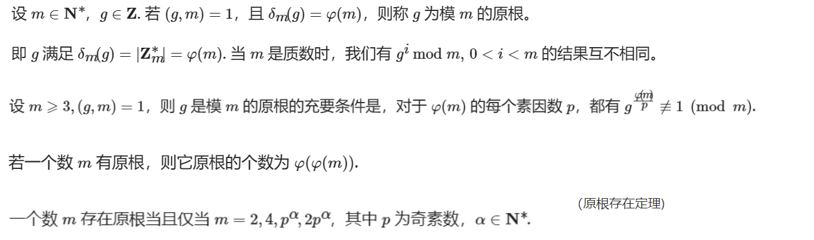
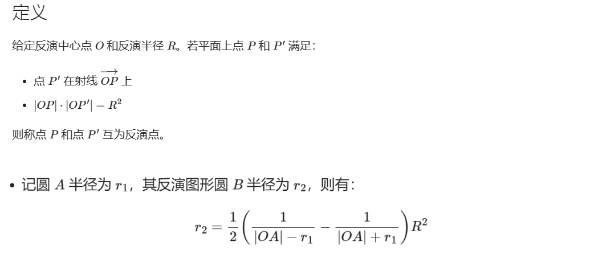
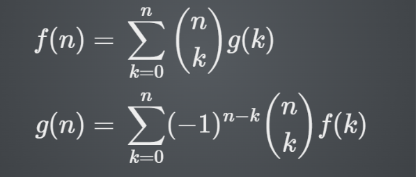
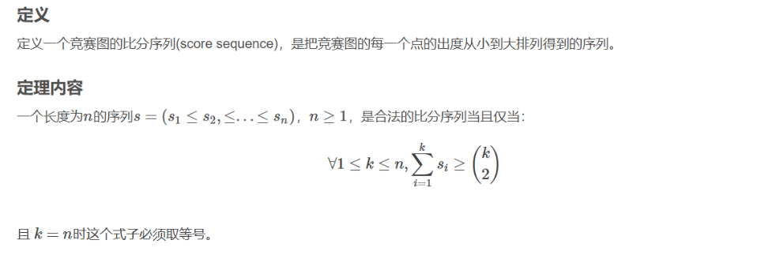
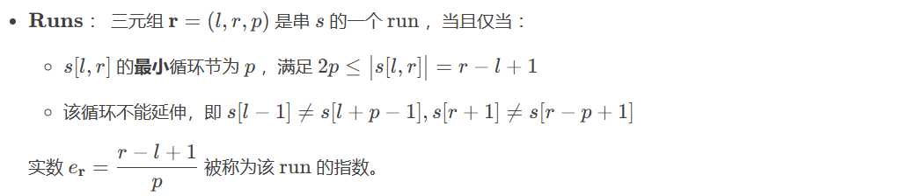
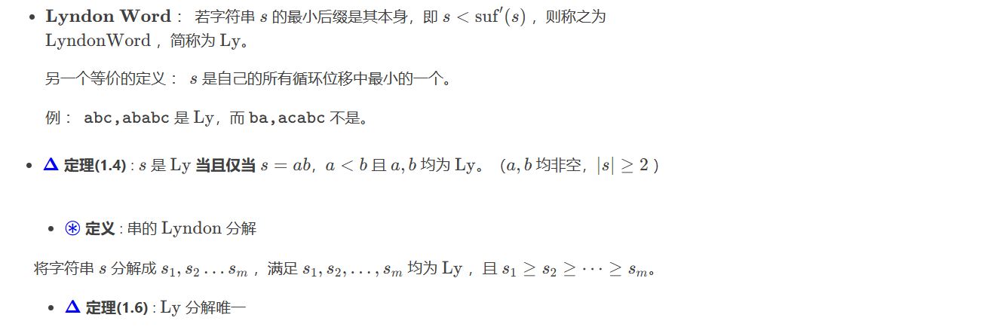
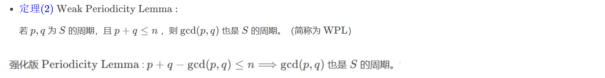

# 知识点

## 数学

### Trick

1. $gcd(f_i,f_j)=f_{gcd(i,j)}$，$f_i$ 表示斐波那契数列的第 $i$ 项

1. $f_{n+m}=f_{n+1}f_{m}+f_{n}f_{m-1}$，$f_i$ 表示斐波那契数列的第 $i$ 项

   负数通过递推求： $f_{-1}=f_1-f_0\ ,\ f_{-2}=f_{0}-f_{-1}\ ,\ f_{-i}=f_{-(i-2)}-f_{-(i-1)}$

1. $e=2.71828\ 18284\ 59045\ 23536\ 02874\ 71352\ 66249\ 77572\ 47093\ 69995\ 95749$

1. $n$ 个变量取值为 $|a_i|\le W$，满足 $\sum{a_i}$ 很小，随机打乱后的前缀和基本满足 $|pre|\le \sqrt{n}W$

### 泰勒展开

$$
f(x)=\sum_{i=0}{\frac{f^{(i)}(x_0)}{i!}(x-x_0)^{i}}\\
取\ x_0\rightarrow0,有\\
e^x=\sum_{i=0}{\frac{x^i}{i!}}=1+x+\frac{x^2}{2!}+...\\
ln(1+x)=\sum_{i=0}{\frac{(-1)^i}{i+1}x^{i+1}}=x-\frac{1}{2}x^2+\frac{1}{3}x^3-...\\
sinx=\sum_{i=0}{\frac{(-1)^n}{(2n+1)!}x^{2n+1}}=x-\frac{x^3}{3!}+\frac{x^5}{5!}-...\\
cosx=\sum_{i=0}{\frac{(-1)^n}{(2n)!}x^{2n}}=1-\frac{x^2}{2!}+\frac{x^4}{4!}-...
$$

### 线性代数

#### LGV 引理

在**有向无环图**中，$A$ 是起点集合，$B$ 是终点集合，大小均为 $n$.

$w(P)$ 表示路径 $P$ 上所有边的边权之积，作为路径的权值；路径计数时，可以将边权都设为 $1$

$e(u,v)$ 表示 $u$ 到 $v$ 所有路径的权值和；路径计数时，表示 $u$ 到 $v$ 的**路径数**。

一个不相交路径的集合 $S$，对应一个排列 $\sigma(S)$，$S_i$ 表示 $A_i$ 到 $B_{\sigma_i}$ 的路径；对于 $i\ne j$，有 $S_i$ 和 $S_j$ 没有公共点。

设路径集合 $S$ 的权值为 $val(S)=(-1)^{t(\sigma(S))}\prod{w(S_i)}$，其中 $t(\sigma)$ 表示排列 $\sigma$ 的逆序对个数.

路径计数时，$\prod_S{w(S_i)}=1$，即 $val(S)=(-1)^{t(\sigma(S))}$，若只计算奇偶性，则 $val(S)=1$

对于矩阵 $M$，它的行列式表示所有 $A\to B$ 的不相交路径集合 $S$ 的权值和，即 $det(M)=\sum_{S}{val(S)}$

$det(M)$ 也表示**不相交路径集合的奇偶数**。

 

#### 矩阵树定理

1. 对于 $n$ 个点的无向无权图，设 $A$ 为邻接矩阵，$A_{ij}$ 表示边 $e_{ij}$ 的个数；$D$ 为度数矩阵 $D_{ii}$ 表示点 $i$ 的度数，$D_{ij}=0(i\ne j)$.

   基尔霍夫矩阵 $K=D-A$，$K'$ 为 $K$ 去掉第 $k$ 行第 $k$ 列的 $n-1$ 阶矩阵 ( $k$ 任意) ，则 $det(K')$ 表示这张图生成树的个数。

2. 在有边权的情况下，将边权理解成**重边条数**，定义生成树的权值为所有边的乘积，则 $det(K')$ 表示所有生成树的权值和。

3. 对于 $n$ 个点的**有向图**，$A$ 表示邻接矩阵，$D^{in}$ 表示**入度**矩阵，$D^{in}_{ii}$ 表示点 $i$ 的入度数，则 $K=D^{in}-A$

   设 $K'$ 为 $K$ 去掉第 $k$ 行第 $k$ 列的 $n-1$ 阶矩阵，则 $det(K')$ 表示这张图**以 $k$ 为根的外向树**个数。

4. 对于 $n$ 个点的有向图，$A$ 表示邻接矩阵，$D^{out}$ 表示**出度**矩阵，$D^{out}_{ii}$ 表示点 $i$ 的出度数，则 $K=D^{out}-A$

   设 $K'$ 为 $K$ 去掉第 $k$ 行第 $k$ 列的 $n-1$ 阶矩阵，则 $det(K')$ 表示这张图**以 $k$ 为根的内向树**个数。

#### BEST 定理

1. 设 $G$ 是有向欧拉图，则 $G$ 中循环同构的欧拉路径数量为 $sum=T\times\prod_{i}{(out_i-1)}$，$T$ 表示图中内向树个数。

2. 在欧拉图中，以任意一点为根的内向树个数相同，即 $T_i=T_j(i\ne j)$。

3. 以 $i$ 出发的欧拉回路个数，等于循环同构的欧拉路数量和 $i$ 的出度的乘积，即 $c_i=sum\times max(1,out_i)$。

### 数论

#### 莫比乌斯函数

 

 

 

#### 莫比乌斯反演

  

**常用公式**

**1. **

   

**2. **
$$
&\sum_{d=1}^{n}\sum_{p=1}^{\lfloor \frac{n}{d}\rfloor}pf(d)\\
&=\sum_{T=1}^{n}\sum_{p|T}p{f(\frac{T}{p})}\\
&=\sum_{T=1}^{n}\sum_{d|T}\frac{T}{d}{f(d)}\\
$$
**3. **

  

**4. **
$$
\sum_{i=1}^n{[d|i]\lfloor \frac{n}{i}\rfloor}\\
设\ i=kd\\
\sum_{i=1}^n{[d|i]\lfloor \frac{n}{i}\rfloor}=\sum_{k=1}^{\lfloor \frac{n}{d} \rfloor}\lfloor \frac{n}{kd}
\rfloor\\
=\sum_{i=1}^{\lfloor \frac{n}{d} \rfloor}{\lfloor \frac{n}{id}\rfloor}\\
$$
相当于把整除条件通过两个向下取整消去了

**5.**
$$
\varphi(n)=\sum_{d|n}{\mu(d)*\frac{n}{d}}\\
即 \varphi=\mu*id
$$
**6.**

 

**常见反演**

 

  

#### 欧拉函数

定义 $\varphi(x)$ 为小于 $x$ 且与 $x$ 互质的数的个数

**性质：**

**1.**

    

**2.**

 

   

**3.**

 

**4.**

$\varphi(\varphi(m))\le \frac{m}{2}$

**幂塔每计算两次，模数至少除2**

 

**欧拉反演**

 

#### 欧拉定理

 

#### 扩展欧拉定理（欧拉降幂）

 

#### 费马小定理

 

#### 整除分块

求 $\sum_{i=1}^{x}{\frac{n}{\lfloor ai+b \rfloor}}$
$$
\begin{flalign}
k&=\lfloor\frac{n}{ai+b} \rfloor=\lfloor\frac{n}{al+b} \rfloor\\
r^*&=\lfloor \frac{n}{k} \rfloor =\lfloor\frac{n}{\lfloor\frac{n}{ai+b} \rfloor} \rfloor\\
\\
r^*&=ai+b\\
r&=max(i)\\
\rArr r&=\lfloor\frac{r^*-b}{a} \rfloor=\lfloor\frac{\lfloor\frac{n}{\lfloor\frac{n}{ai+b} \rfloor} \rfloor-b}{a} \rfloor
\end{flalign}
$$

#### 类欧几里得算法

 

 

 

#### 积性函数

 

**约数个数函数的性质**

 

**狄利克雷卷积性质**

 

  

#### 杜教筛

 

  

 

**结论：找个能快速求前缀和的 $h(x)$ ，套入以下公式**

 

#### 威尔逊定理

$p$ 是质数当且仅当 $p-1$ 的阶乘在模 $p$ 意义下等于 $-1$
$$
(p-1)!\equiv -1\ (mod\ p),当且仅当p为素数
$$

#### 阶

  

 

 

 

 

#### 原根

 

### 计算几何

#### 反演变换

   

1. 过 $O$ 的圆的反演是一条直线
2. 不过 $O$ 的圆的反演是还一个圆，在 $R$ 内的部分反演到 $R$ 外， $R$ 外的部分反演到 $R$ 内，和反演圆的交点个数不变
3. 不过 $O$ 的直线的反演是过 $O$ 的圆
4. 过 $O$ 的直线反演是它本身
5. 两个图形相切且存在不为点 $O$ 的切点，则他们的反演图形也相切
6. 反演之后的圆的圆心不是反演之前的圆的圆心的反演
7. 反演之后的圆的圆心必在反演圆和被反演圆的圆心的连心线的延长线上

#### Trick

1. 凸多边形对角线条数为 $\frac{n(n-3)}{2}$

### 组合数学

#### 二项式反演

  

#### 卡特兰数

- $n$ 对括号合法⽅案数
- $n$ 个结点⼆叉树个数
- $n\times n$ 方格到对角线下方的单调路径数
- 凸 $n+2$ 边形的三角划分数

 

#### 斯特林数

$n\brack m$ 为第一类斯特林数，表示把 $n$ 个元素组成 $m$ 个圆排列 (圆之间无顺序区别) 的个数

$n\brace m$ 为第二类斯特林数，表示把 $n$ 个元素划分到 $m$ 个非空集合 (集合之间无顺序区别) 的方案数
$$
{n\brack m}={n-1\brack m-1}+(n-1){n-1\brack m}\\
{n\brace m}={n-1\brack m-1}+m{n-1\brace m}\\
{n\brace m}=\sum_{i=0}^m{\frac{(-1)^{m-i}i^n}{i!(m-i)!}}
$$

#### 错位排列

$$
\begin{aligned}
D_1&=0\\
D_2&=1\\
D_n&=(n-1)(D_{n-1}+D_{n-2})\\
&=n!(\frac{1}{2!}-\frac{1}{3!}+...+(-1)^n\frac{1}{n!})\\
&=\lfloor \frac{n!}{e}+0.5 \rfloor
\end{aligned}
$$

#### min/max 容斥

把 交集/并集 换成 $min/max$ 即可

由于期望的线性性，求满足若干条件的最大值的期望时，可以枚举条件的子集，计算最小值的期望，我们只需要关心什么时候首次满足条件即可
$$
\max_{i\in S}(x_i)=\sum_{T\subseteq S,T\ne \varnothing}{(-1)^{|T|-1}\min_{j\in T}{(x_j)}}\\
\min_{i\in S}(x_i)=\sum_{T\subseteq S,T\ne \varnothing}{(-1)^{|T|-1}\max_{j\in T}{(x_j)}}\\
E(\max_{i\in S}(x_i))=\sum_{T\subseteq S,T\ne \varnothing}{(-1)^{|T|-1}E(\min_{j\in T}{(x_j)}})\\
$$

#### 常用公式

拆自然数幂
$$
i^k=\sum^{k}_{j=0}{S(k,j)\times C(i,j)\times j!}
$$

组合数递推式

 

广义二项式系数/定理

 

二项式定理 $a=b=1$ 

 

二项式定理 $a=1,b=-1$

 
$$
C(n,0)+C(n,2)+...+C(n,2k)=C(n,1)+C(n,3)+...+C(n,2k+1)\\
=2^{n-1}
$$

$$
\sum_{i=0}^{\lfloor n/2\rfloor}C(n,2i)=\sum_{i=0}^{\lfloor n/2\rfloor}C(n,2i+1)=2^{n-1}
$$

范德蒙德卷积（合并组合数）

 

$n=m$ 特殊情况

 

二项式定理求导

 

拆排列数

 

组合数性质

 

组合数二次求导

 

错位排列

 

### 博弈论

#### 巴什博奕

 

#### 二分图博弈

 

#### 斐波那契博弈

 

#### 威佐夫博弈

 

#### Chomp游戏

 

#### 阶梯Nim博弈

 

先手必败当且仅当**奇数**阶梯上的石子数异或和为 $0$ 

#### Nimk游戏

 

 

计算**二进制位**  $1$ 的个数在模 $k+1$，若对每一位都满足结果为 $0$ ，则先手必败 

### 生成函数

#### 拉格朗日插值

$$
f(x)=\sum^{n+1}_{i=1}y_i\prod_{j\ne i}\frac{x-x_j}{x_i-x_j}
$$

#### 生成函数展开

$$
\begin{aligned}
\frac{1}{1-ax}&=\sum^{\infin}_{i=0}a^ix^i\\
\frac{1}{(1-x)^2}&=\sum^{\infin}_{i=0}(i+1)x^i\\
\frac{1}{(1-x)^n}&=\sum^{\infin}_{i=0}\binom{n-1+i}{i}x^i\\
(1+x)^\alpha&=1+\sum_{n=1}^{\infty}{\frac{\alpha(\alpha-1)(\alpha-2)...(\alpha-n+1)}{n!}x^n}\\
ln\frac{1}{1-x^k}&=\sum_{i=1}^{\infin}\frac{1}{i}x^{ik}\\

\end{aligned}
$$

#### 常用计数结论

 

#### 指数公式定理

  

### 期望与概率

 

 

 

 

 

 

 

## 图论

### 连通性定理

对于一个无向图，如果它的补图不联通，那么这个图是连通图

一个不联通的图，它的补图是连通图

### 点双,圆方树

1. 对于一个点双中的两点，它们之间简单路径的并集，恰好完全等于这个点双
   即：同一个点双中的两点 $u,v$ 之间一定存在一条简单路径经过给定的在同一个点双内的另一点 $w$

2. 两点间割点的数量，等价于广义圆方树上圆点的数量，即 $dis(u,v)/2+1$

3. 统计路径信息时，给每个圆点和方点赋上合适的值，然后树形 $dp$

4. 树剖后若要单点修改，可以把每个方点的值用儿子表示，修改时只要修改父节点即可，查询时若 $lca$ 为方点，要特判查询父亲

5. 对于一个点双联通图，若其中存在奇环，则点双中任意一个点都在至少一个奇环中

### 网络流建模

1. **最大权闭合子图**

   超级源点 $s$ 向正权点连边，边权为点权，负权点向超级汇点 $t$ 连边，边权为点权的绝对值，原图连边正无穷

   最大权为 **所有正权值的和 - 最大流**

2. **最小割构造**

   跑完最大流后，从原点 $S$ 开始走流量不为 $0$ 的边进行 $bfs$，可达的点集记为 $S'$

   一端在 $S'$ 中，一端不在 $S'$ 中的边，形成一个最小割集

   **最小割可行边（所有割集的并集）**

   跑完最大流后，将残量网络进行强连通缩点，所有**满流**且**两端不在同一个联通分量**的边是最小割可行边。

   割的构造 : 把这条边左端点到 $S$ 的路径钦定为 $S$ 集合,其余为 $T$ 集合,然后把所有 $S,T$ 之间的边割断,这是紧的,而且该边是最小割的一部分。

   不割的构造 : 如果右端点不是 $T$ ,把这条边右端点到 $S$ 的路径钦定为$S$ 集合。否则左端点必然不是$S$ ,把这条边左端点到 $T$ 的路径钦定为 $T$ 集合即可。

   **最小割必须边（所有割集的交集）**

   残量网络进行强连通缩点后，所有**满流**且**一端在 $S$ 联通分量,一端在 $T$ 联通分量**的边是最小割必须边

3. 网络流的**流量出现负值**，可以统一加上 $INF$ 来偏移

4. 求流量为 $x$ 时的最小费用，通过连一些辅助边，限制最大流恰好为 $x$，然后跑最小费用最大流

5. **上下界最小费用可行流**

   建立虚拟源汇 $S,T$，对于原图每个点，令 $d[i]$ 表示所有入边的流量下界$-$所有出边的流量下界

   若 $d[i]>0$，连边 $(S,i,d[i],0)$，若 $d[i]<0$，连边 $(i,T,-d[i],0)$

   对于原图的边，连边 $(u,v,upp-low,w)$

   若为有源汇图，连边 $(T0,S0,INF,0)$

   最小费用为 **每条边的下界*费用+新图的最小费用最大流**

6. **上下界可行流**

   建立虚拟源汇 $S,T$，对于原图每个点，令 $d[i]$ 表示所有入边的流量下界$-$所有出边的流量下界

   若 $d[i]>0$，连边 $(S,i,d[i])$，若 $d[i]<0$，连边 $(i,T,-d[i])$

   对于原图的边，连边 $(u,v,upp-low)$

   若为有源汇图，连边 $(T0,S0,INF)$

   求最大流后，**每条边的流量+下界** 即为可行流

7. **有源汇上下界最小流**

   按 **上下界可行流** 方式建图，但是 **先不建边$(T0,S0)$**

   按虚拟源汇跑一遍网络流，得到残量网络

   然后建边 $(T0,S0,INF)$，按虚拟源汇再跑一遍网络流

   $T0\to S0$ 的流量即是答案，也就是**最后一条边的反向边边权**

### 兰道定理（竞赛图判定）

  

### 二分图

1. 最小点覆盖：选最少的点，满足每条边至少有一个端点被选。

   最小边覆盖：选最少的边，满足每个点至少有一个邻边被选。

   最大独立集：选最多的点，满足两两之间没有边相连。

   最大匹配：选最多的边，满足两两之间没有公共点。

   最小路径覆盖：对于一个 $DAG$ ，选最少条路径，使得每个顶点**属于且仅属于**一条路径。

   二分图完美匹配：若两侧点集为 $X,Y$，大小为 $min(|X|,|Y|)$ 的匹配为完美匹配。

   二分图最大团：选左侧点集 $X$ 和右侧点集 $Y$，使 $|X|+|Y|$ 最大，满足 $X$ 中的每个顶点和 $Y$ 中每个顶点都有边。

   二分图补图：对于左侧点 $x$ 和右侧点 $y$，如果原图中 $x\to y$ 存在，则补图中不存在，否则 $x\to y$ 在补图中存在。 

2. $Konig$ 定理：二分图中，**最小点覆盖$=$最大匹配数**。

   最小点覆盖构造：先求出一组最大匹配，最大匹配上的点标记为匹配点，边标记为匹配边。

   找出**右侧**的非匹配点集合 $S$，每次从 $S$ 中取一个点开始 $dfs$，找出所有 $非匹配边\to 匹配边\to 非匹配边\to...\to 匹配边$ 的路径，并标记所有经过的点（注意一定是**匹配边结尾**）。

   **左侧所有的标记点**和**右侧所有的非标记点**组成一个最小点覆盖。

3. **最大独立集 $=$ 总点数 $-$ 最小点覆盖**。（对于**一般图也成立**）

   最大独立集构造：先求出最小点覆盖，再取补集就是最大独立集。

4. **最小边覆盖 $=$ 总点数 $-$ 最大匹配**。

5. 设二分图 $|X|\le|Y|$，称 $X$ 的子集 $S$ 连向 $Y$ 的点集为 $S$ 的**邻域**，记作 $N(S)$。

   $Hall$ 定理：二分图**存在完美匹配的充要条件**为对于 $X$ 的所有子集 $S$，满足 $|S|\le |N(S)|$。

6. **DAG 最小路径覆盖 $=$ 总点数 $−$ 拆点二分图最大匹配**

   拆点：每个点 $i$ 拆成 $i_{in}\to i_{out}$，流量为 $1$；原 $DAG$ 上，每条边 $u\to v$ 连 $u_{out}\to v_{in}$ ，流量为 $1$ 。

7. 二分图中，**最大团 $=$ 补图的最大独立集**。

8. 二分图最大匹配**非必经点**：在残量网络中，**$S$ 可以到达**的**左**部点和**可以到达 $T$** 的**右**部点是非必经点。

   二分图最大匹配**必经点**：在残量网络中，**$S$ 不能到达**的**左**部点和**不能到达 $T$** 的**右**部点是必经点。

   如果在**左部非必经点和右部非必经点**间连一条边，可以使二分图最大匹配**增加 $1$**

   **非必经点**求法：

   1. 在残量网络上，从 $S$ 开始 $dfs1$，走**流量非零**的边，可以到达的**左部点**为非必经点；

      从 $T$ 开始 $dfs2$，走**反边流量非零**的边，可以到达的右部点为非必经点。

   2. 先跑 $dinic$ ，$dis[i]\ne 0$ 的**左部点**为非必经点。

      把所有边反向，流量恢复为初始状态，以 $T$ 为源点跑 $dinic$，$dis[i]\ne 0$ 的**右部点**为非必经点。(通过 $swap(S,T)$ 实现)

### 弦图

**弦**：连接环中不相邻两点的边。

**弦图**：任意长度大于 $3$ 的环都有一个弦的图称为弦图。

**最小染色**：用最少的颜色给点染色使得所有边连接的两点颜色不同。

**团**：完全子图。

**极大团**：不是其他团子图的图。

**最大团**：点数最大的团。

### 图论Trick

1. 在一棵树上选 $k$ 个点，按照 $dfs$ 序排序为 $\{a_1,a_2...a_k\}$

   它们形成的极小联通子树的边权和的二倍等于 $dis(a_1,a_2)+dis(a_2,a_3)+...dis(a_{k-1},a_k)+dis(a_k,a_1)$

   它们所有点的 $lca$ 为 $lca(a_1,a_k)$

2. 最小割在数值上等于最大流

   最小割的割边数量：将最大流中流满的边赋值 $1$，其它边赋值 $INF$，再跑一遍最大流，注意**反边要全部清0**

3. $LCA$ 具有区间可加性，可以用线段树维护

4. **分层图最短路建模**

   如果有 $k$ 次机会免费/特殊代价走一条边，可以建 $k$ 张完全相同的图，每张图对应点以特殊边权$/0$ 相连，每向下走一层代表用了一次机会，**答案不一定在最后一层，考虑每一层的终点**

   如果有 $k$ 个不同的边集，可以建 $k$ 张图，然后建一张虚层，和 $k$ 张图连起来，通过虚层实现层与层的转移

   如果 $k$ 个机会逆向行使，建 $k$ 张相同的图，层与层之间用反边连接

5. 二分图最大权完美匹配用 $KM$ 算法做到 $n^3$ 复杂度，若两边点数不一致，对较少的一部分补点，不存在的边连边权 $0$ 的边

### prufer序列

1. $n$ 个节点完全图，无根生成树为 $n^{n-2}$ 个，有根生成树为 $n^{n-1}$ 个

2. $n$ 个节点完全图，第 $i$ 个点的度数为 $d_i$，生成树个数为 $\frac{(n-2)!}{\prod(d_i-1)!}$
3. $n$ 个点，被分成 $k$ 个连通块，通过加入 $k-1$ 条边使原图联通的方案数为 $n^{k-2}\prod^{k}_{i=1}siz_i$

## 字符串

### Runs

 

### Lyndon 分解

   

### 周期定理

  

## Trick

1. 对于确定的初始状态仅有极少数（大多数时候仅有一个），其余的状态与相邻的部分（大多数时候是相邻的点）有关的 $dp$，考虑（放到图上）以最短路的方式进行转移，可以考虑 $dijkstra$。

2. 一组数中取任意个数求最大/最小异或和用线性基，取两个数求最大/最小异或和则可以用 $01trie$ 解决
3. 在存在**区间推平**操作前提下，颜色段均摊有两层含义
   1. 随机数据：任意时刻的颜色段个数期望为 $O(log_2n)$
   2. 非随机数据：每次推平时访问的颜色段个数为均摊 $O(n)$，单次有可能达到 $O(n)$
4. 带权并查集**写按秩合并**，**不要写路径压缩**。
5. 遇到**点对统计/路径计数**问题，可以考虑**点分治**。
6. 遇到区间问题，例如**统计合法区间个数/求最短合法区间**等问题，可以考虑**线段树+扫描线**处理。

   询问离线下来，从左往右枚举右端点，用线段树等数据结构维护合法的左端点，每次考虑加入一个新的右端点对左端点的影响。

## DS

### Kruskal 重构树

#### 边权重构树

将原图 $G$ 的所有边按边权排序，用并查集维护连通性，对于每条边 $u-v$，如果 $u,v$ 不联通，找到 $u,v$ 的代表元 $U,V$，新建节点 $c$，将并查集 $U,V$ 的父亲设为 $c$，在 $T$ 中连边 $c\rightarrow U$ 和 $c\rightarrow V$。注意 $U,V$ 可能不是原树节点。

通常设置虚点 $c$ 的权值 $w_c=w(u,v)$。

得到一棵大小为 $2n-1$ 且以 $2n-1$ 为根的有根树 $T$，是 $G$ 的 $kruskal$ 重构树。**（空间开 $2n$）**

性质（边权从小到大）：

1. 原节点有 $n$ 个，表示某个点；新建的虚点有 $n-1$ 个，表示某条边。

2. $G$ 的所有节点是 $T$ 上的叶子，$T$ 是一棵二叉树。

3. **对于任意新节点 $u$ 及其祖先 $v$，有 $w_u\le w_v$。**

4. 求节点 $x$ 在原图上**经过权值 $\le d$ 的边可达的所有点**（只保留边权 $\le d$ 的边时，$x$ 所在的连通块大小），可以转化为：

   求 $x$ 在 $T$ 上最浅的权值 $\le d$ 的祖先 $f$ ，**$f$ 子树内所有叶子节点**均可达。一般倍增求解 $f$ 。

#### 点权重构树

##### 构造方法一（二叉树）：

为原图每条边巧妙赋值，把点权转化成边权；若限制经过点权的最大值，则 $w(u,v)=max(w_u,w_v)$，若限制经过点权的最小值，则 $w(u,v)=min(w_u,w_v)$

##### 构造方法二（多叉树）：

若题限制点权最大值：

将节点按权值从小到大排序，按顺序遍历每个点 $i$ 及其所有出边 $(i,u)$。

若 $u$ 已经遍历过，则 $w_i\ge w_u$，$max(w_i,w_u)$ 取到 $w_i$，此时若 $i,u$ 不连通则将 $u$ 的代表元 $U$ 的父亲设为 $i$，在 $T$ 中连边 $i\rightarrow U$。

### 长链剖分

1. 将子树深度最大的儿子作为重儿子进行剖分。
2. 从根节点到任意叶子节点经过的轻边不超过 $\sqrt{n}$ 条，比重链剖分的 $\log n$ 条稍劣。
3. 一个节点的 $k$ 级祖先所在长链的长度 $\ge k$。
4. 选一个节点能覆盖它到根的所有节点。把所有长链按长度排序，选 $k$ 个节点，覆盖的最多节点数就是前 $k$ 条长链长度之和，选择的节点即前 $k$ 条长链的末端。

### 点分树（动态点分治）

1. 每一层的分治重心和上一层的分治重心连边，形成的分治树 $T$ 就是点分树。
2. 点分树的高度不超过 $\log n$，意味着可以**暴力跳父节点统计答案**。
3. 点分树上每个节点的度数 $\le$ **在原树上的度数 +1**。（一个父亲，$deg$ 个儿子）
